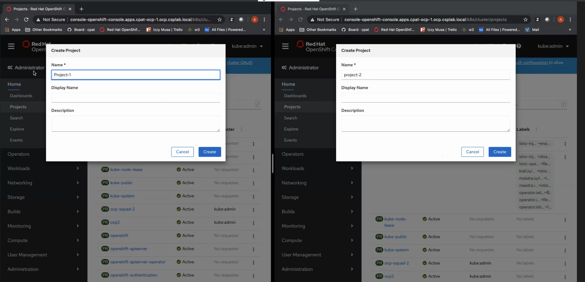
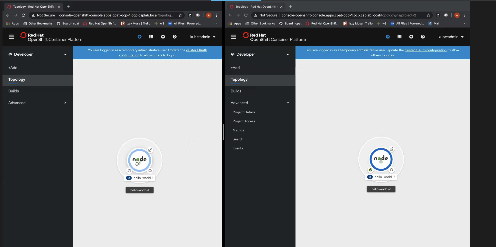
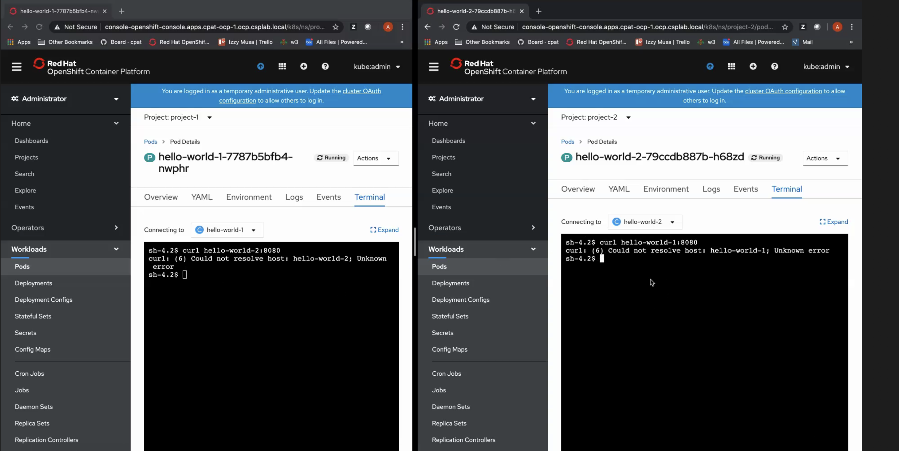
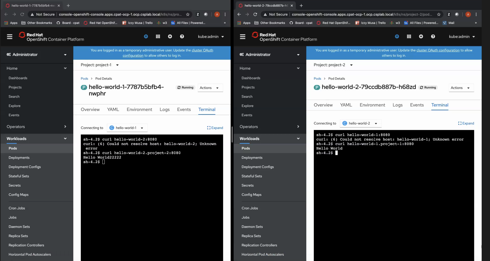
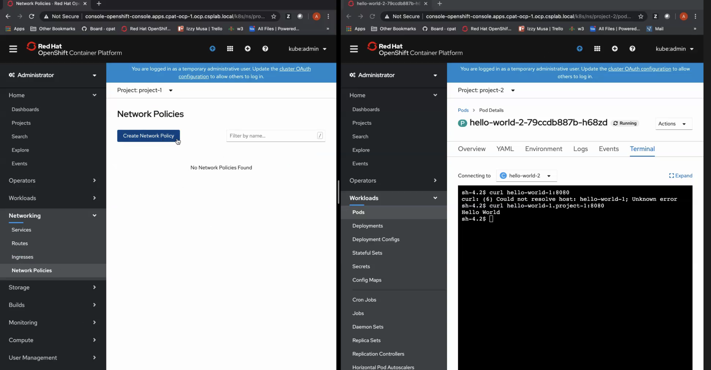
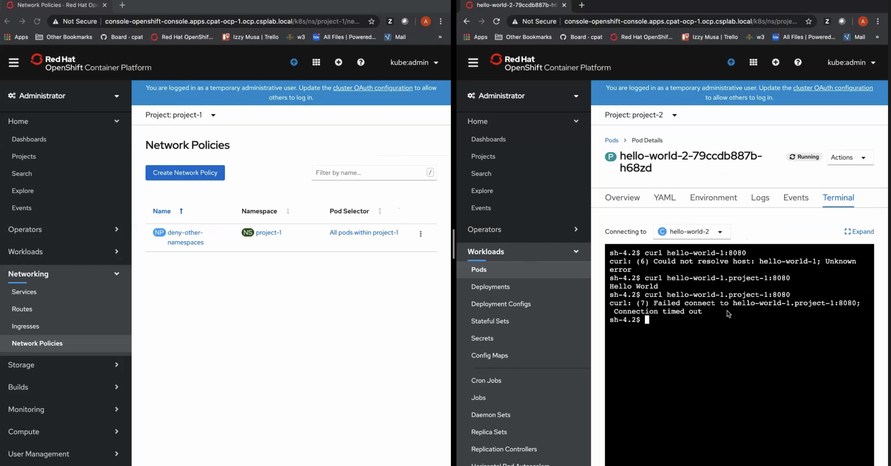

# Developer Features on OpenShift 4

## Enable Disable connectivity across projects

### Prerequisites

* A working OCP 4+ cluster

By default, all Pods in a project are accessible from other Pods and network endpoints. To enable/disable connectivity across projects, follow the steps below.

## Steps

1. Create two projects in the cluster.

     

2. Deploy application in each project.

     

     As the applications are getting build

      

3. Open the pod terminal for both the applications

     

4. Test connectivity of a service within the same namespace.

     

5. Test connectivity of a service in another namespace. By default service in project-1 should be accessible from project-2. 

    But there is a catch. If we try the using the same convention, it fails

     

     Instead, we have to call the service using ```<servicename>.<namespacename>```

     

    It is also possible to access the services using ClusterIP but it is better to avoid it since the ClusterIP is dynamically generated and can change as the pod stops and starts.

6. To restrict access of a service in another project we need to create a network policy 

    Click create network policy

     

    Select the one that denies access to other namespaces

     
    
7. Test connectivity of a service in another namespace. It should not be able to access it now.

     

8. Test connectivity of a service within the same namespace. It should still be able to access it.

     

Note: We can customize the network polices to allow access to different projects and deny access to others. The following documentation provides further guidance on that https://docs.openshift.com/container-platform/4.3/networking/configuring-networkpolicy.html.
